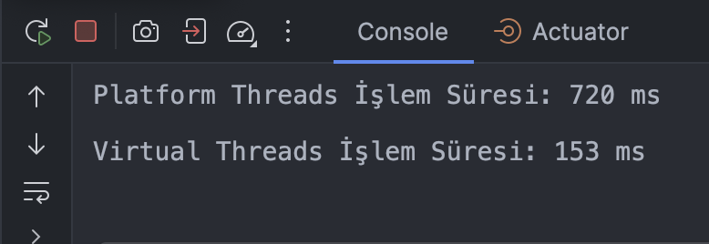

# **Java ile Virtual Threads Kullanımı**

Proje **Java 21** ve **Spring Boot** kullanılarak geliştirilmiş bir finansal işlem simüle eden bir örnek projedir.
Projede amaç Java’nın **virtual threads** özelliğini kullanılarak eşzamanlı yüksek hacimli işlemlerin nasıl verimli bir şekilde yönetilebileceği gösterilmesidir.

---
## **Virtual Threads Nedir?**

Bir bankanın para transferi yönetim sistemi geliştiriyorsunuz diyelim.
Sistem kullanıcıların aynı anda binlerce para transferi talebini işleyebilmesini sağlamalı.
Ancak geleneksel thread-per-request modeli ile uygulamanızda ciddi sorunlarla karşılaşıyorsunuz.

* Her bir işlem için bir thread oluşturmak, işletim sistemi kaynaklarını hızla tüketiyor. Örneğin 10.000 işlemde sistem çökebiliyor.
* Para transferi sırasında, harici ödeme servislerinden yanıt bekleyen thread'ler kaynakları boşa harcıyor.
* Kullanıcılar transferlerin uzun sürdüğünden şikayet ediyor.

**Bu senaryoda yeni bir teknoloji olan virtual threads'i kullanabiliriz. 
Java 21 ile birlikte gelen Project Loom  bu tip sorunlara çözüm sunuyor.**

## **Özellikler**

- **Virtual Threads** kullanımı sayesinde:
    - **Bloklama işlemleri daha efektif kullanma.**
    - **Yüksek eşzamanlılık desteği (10.000+ işlem).**
    - **Azaltılmış bellek ve CPU kullanımı.**
- Platform threads (mevcur java threadleri) ile karşılaştırmalı performans analizi.

---

## **Virtual Threads ile Eşzamanlı API Çağrısı (Örnek)**

Bu projede Virtual Threads kullanılarak yüksek eşzamanlılıkta API çağrıları yapılabilmektedir. Projede, dış bir servisten **1'den 100'e kadar ID'lere** sahip veriler çekilmektedir.

### **Kod Örneği**

Bu kod, harici bir API'den paralel olarak 100 veri çeker ve Virtual Threads ile bu işlemi optimize eder:

``` java
List<String> apiEndpoints = IntStream.rangeClosed(1, 100)
        .mapToObj(id -> "https://jsonplaceholder.typicode.com/posts/" + id)
        .toList();

try (ExecutorService virtualThreadExecutor = Executors.newVirtualThreadPerTaskExecutor()) {
List<Future<String>> apiResponses = apiEndpoints.stream()
        .map(endpoint -> virtualThreadExecutor.submit(() -> httpRequestUtil.sendGetRequest(endpoint)))
        .toList();

List<String> results = apiResponses.stream()
        .map(future -> {
          try {
            return future.get();
          } catch (Exception ex) {
            throw new RuntimeException("API çağrısı başarısız: " + ex.getMessage());
          }
        }).toList();
}
```

## **Platform Threads ile Eşzamanlı API Çağrısı**

Virtual Threads yerine Platform Threads kullanılarak da harici API çağrıları gerçekleştirilebilir. Ancak, bu yöntem fiziksel thread'lere bağımlı olduğundan, yüksek eşzamanlılık durumlarında kaynak tüketimi daha fazladır.

### **Kod Örneği**

Aşağıdaki kod, Fixed Thread Pool kullanılarak 1'den 100'e kadar ID'ler için paralel API çağrıları yapar:

``` java
List<String> apiEndpoints = IntStream.rangeClosed(1, 100)
        .mapToObj(id -> "https://jsonplaceholder.typicode.com/posts/" + id)
        .toList();

ExecutorService threadPoolExecutor = Executors.newFixedThreadPool(10);

try {
List<Future<String>> apiResponses = apiEndpoints.stream()
        .map(endpoint -> threadPoolExecutor.submit(() -> httpRequestUtil.sendGetRequest(endpoint)))
        .toList();

List<String> results = apiResponses.stream()
        .map(future -> {
          try {
            return future.get();
          } catch (Exception ex) {
            throw new RuntimeException("API çağrısı başarısız: " + ex.getMessage());
          }
        }).toList();
} finally {
        threadPoolExecutor.shutdown();
}
```
Bu kod, Platform Threads kullanarak harici API çağrılarını eşzamanlı olarak gerçekleştirir. Ancak Fixed Thread Pool kullanımı nedeniyle fiziksel kaynak tüketimi (CPU ve bellek) daha yüksektir.


### **Non-blocking'in Rolü ve Virtual Threads ile Farkı**

- **Non-blocking:** Kod asenkron çalışır ve hiçbir noktada beklemez.
    - Örneğin Reactive Streams (Spring Webflux gibi) veri akışı bittiğinde callback mekanizmalarıyla devam eder.


- **Virtual Threads:** Kod bloklamaya devam eder ancak bu bloklama artık ölçeklenebilir bir şekilde yönetilir.
    - Kodunuz okunaklı ve basit kalır.
    - Bloklama operasyonlarını yeniden yazmak zorunda kalmazsınız.


## **Proje Gereksinimleri**

- **Java 21** veya üstü (Virtual Threads desteği için gerekli).
- **Maven** (Projenin bağımlılıklarını yönetmek için).
- **Spring Boot 3.1+ (Bu projede 3.4 kullanılıyor)**.

---

## **Projenin Çalıştırılması**

### **Adım 1: Projeyi Klonlayın**
```bash
git clone https://github.com/YunusEmreNalbant/java-virtual-threads.git
cd java-virtual-threads
```

### **Adım 2: Maven ile projeyi build edin**
```bash
mvn clean install
```

### **Adım 3: Spring Boot ile projeyi calıstırın**
```bash
mvn spring-boot:run
```

## **API Kullanımı**
* Proje içerisinde **example1** ve **example2** klasörleri bulunmaktadır. 
* example1 içerisindeki örnek dış bir servise istek atmaz. Tamamen simüle bir finansal işlem gerçekleştirir.
* example2 içerisindeki örnek dış bir servise istek atmaktadır. PlatformThreads için ayrı bir kod, VirtualThreads için ayrı bir kod örneği yapıldı ve bunların performansları karşılaştırıldı.

### **1. Tekli Para Transferi**

**Endpoint:** `/api/money-transfers`  
**Metot:** `POST`  
**Parametreler:**
- `senderAccount`: Gönderen hesabın ID'si.
- `receiverAccount`: Alıcı hesabın ID'si.
- `amount`: Gönderilen tutar.

**Örnek İstek:**
```bash
curl -X POST "http://localhost:8080/api/money-transfers?senderAccount=12345&receiverAccount=67890&amount=1000.50"
```
**Sonuç:**
```json
"Transfer of ₺1000.50 from 12345 to 67890 is being processed."
```

### **2. Toplu Para Transferi**
Birden fazla işlemi paralel olarak başlatmak için aşağıdaki script’i kullanabilirsiniz:

```bash
for i in {1..100}; do
  curl -X POST "http://localhost:8080/api/money-transfers?senderAccount=User$i&receiverAccount=User$((i+1))&amount=$i.00" &
done
```

### **3. Dış bir API İle Performans Ölçümü**

Virtual Threads ve Platform Threads ile yapılan API çağrılarının performansını ölçmek için iki farklı endpoint bulunmaktadır:

- **Virtual Threads:** `/api/external-data-virtual`
- **Platform Threads:** `/api/external-data-platform`

### **Örnek Çalıştırma**

```bash
curl "http://localhost:8080/api/external-data-virtual"
curl "http://localhost:8080/api/external-data-platform"
```

### Performans Karşılaştırması
